# DeepGame (A Game-Based Approximate Verification of Deep Neural Networks with Provable Guarantees)

Min Wu, Matthew Wicker, Wenjie Ruan, Xiaowei Huang, Marta Kwiatkowska.

arXiv: 1807.03571
https://arxiv.org/abs/1807.03571

# Abstract
Despite the improved accuracy of deep neural networks, the discovery of adversarial examples has raised serious safety concerns. In this paper, we study two variants of pointwise robustness, the maximum safe radius problem, which for a given input sample computes the minimum distance to an adversarial example, and the feature robustness problem, which aims to quantify the robustness of individual features to adversarial perturbations. We demonstrate that, under the assumption of Lipschitz continuity, both problems can be approximated using finite optimisation by discretising the input space, and the approximation has provable guarantees, i.e., the error is bounded. We then show that the resulting optimisation problems can be reduced to the solution of two-player turn-based games, where the first player selects features and the second perturbs the image within the feature. While the second player aims to minimise the distance to an adversarial example, depending on the optimisation objective the first player can be cooperative or competitive. We employ an anytime approach to solve the games, in the sense of approximating the value of a game by monotonically improving its upper and lower bounds. The Monte Carlo tree search algorithm is applied to compute upper bounds for both games, and the Admissible A* and the Alpha-Beta Pruning algorithms are, respectively, used to compute lower bounds for the maximum safety radius and feature robustness games. When working on the upper bound of the maximum safe radius problem, our tool demonstrates competitive performance against existing adversarial example crafting algorithms. Furthermore, we show how our framework can be deployed to evaluate pointwise robustness of neural networks in safety-critical applications such as traffic sign recognition in self-driving cars.

# Problem Statement
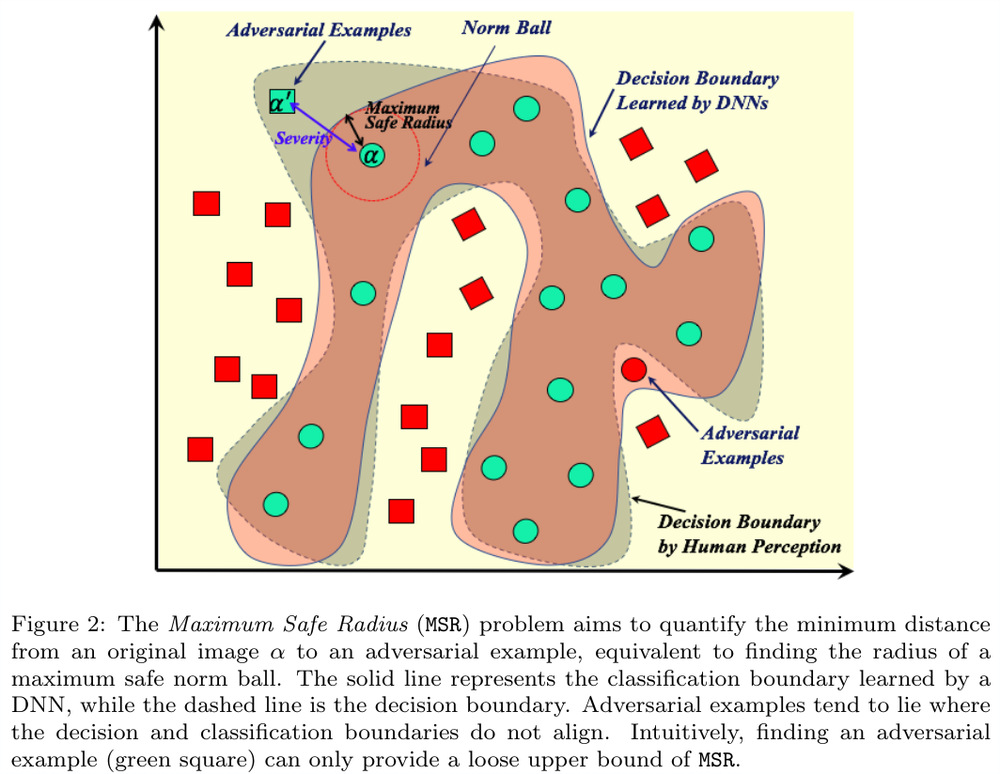
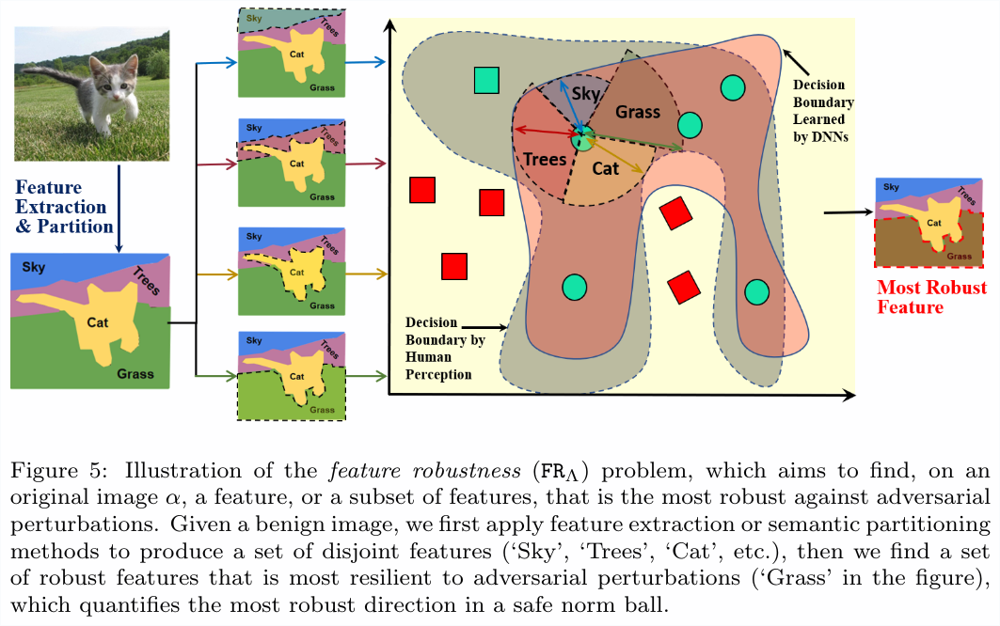

# Approach Architecture
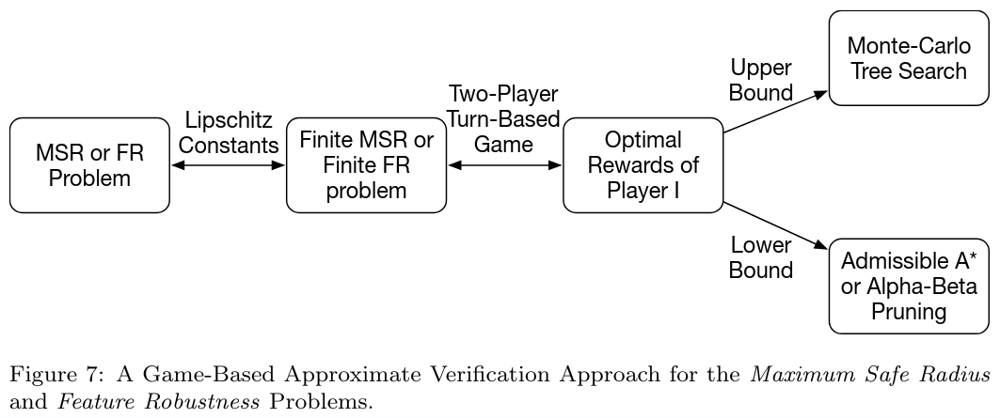
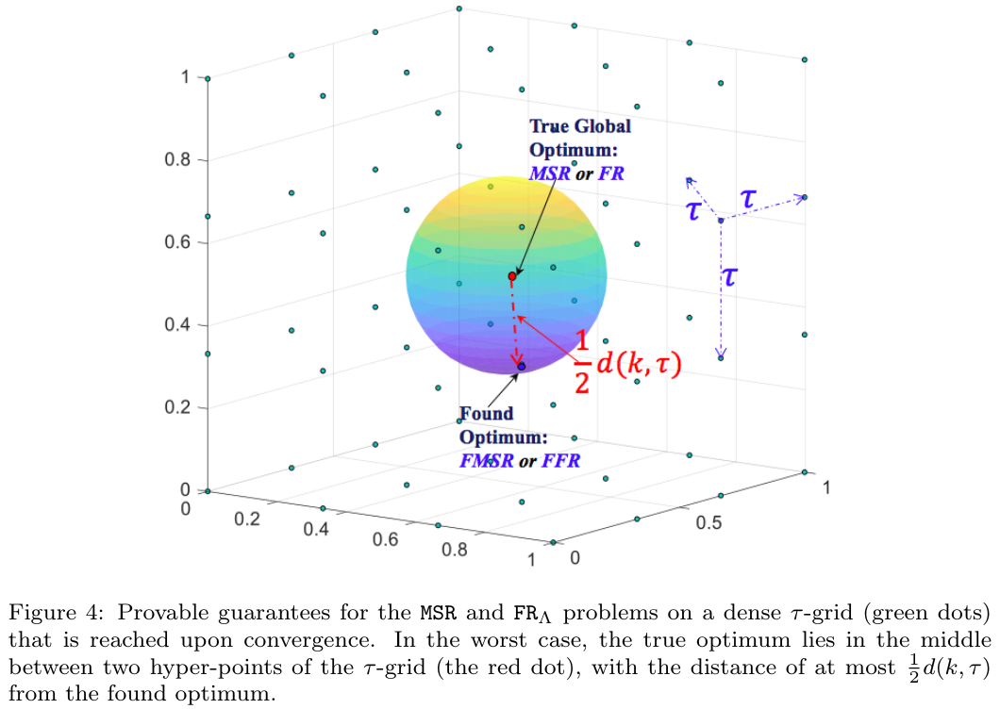
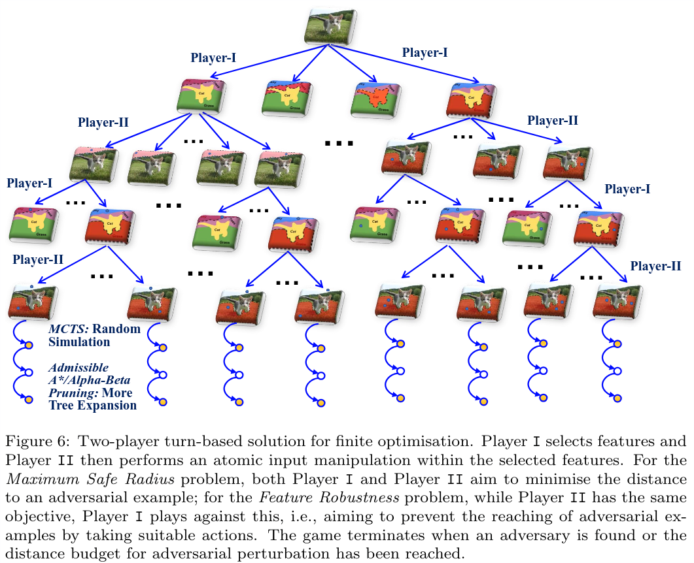

# Convergence Results
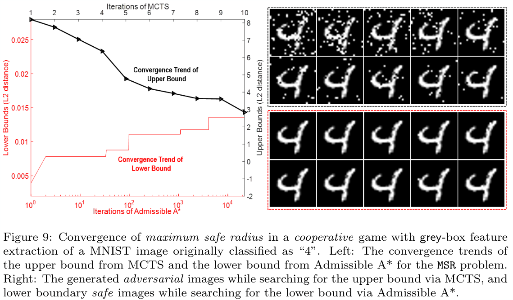
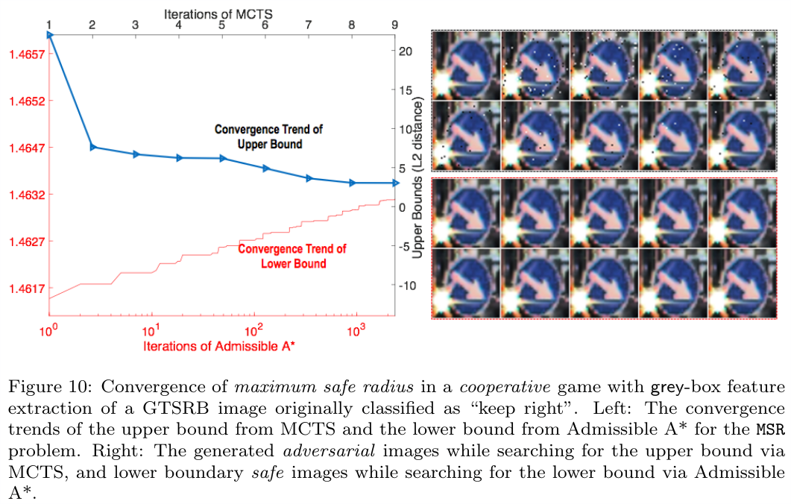
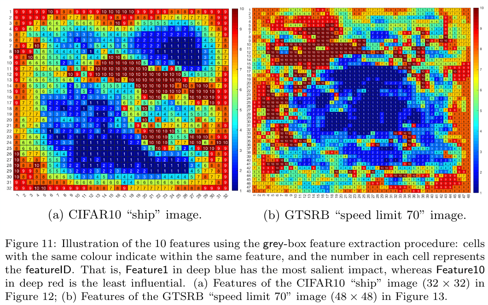
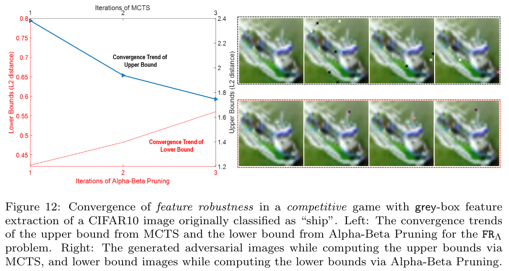
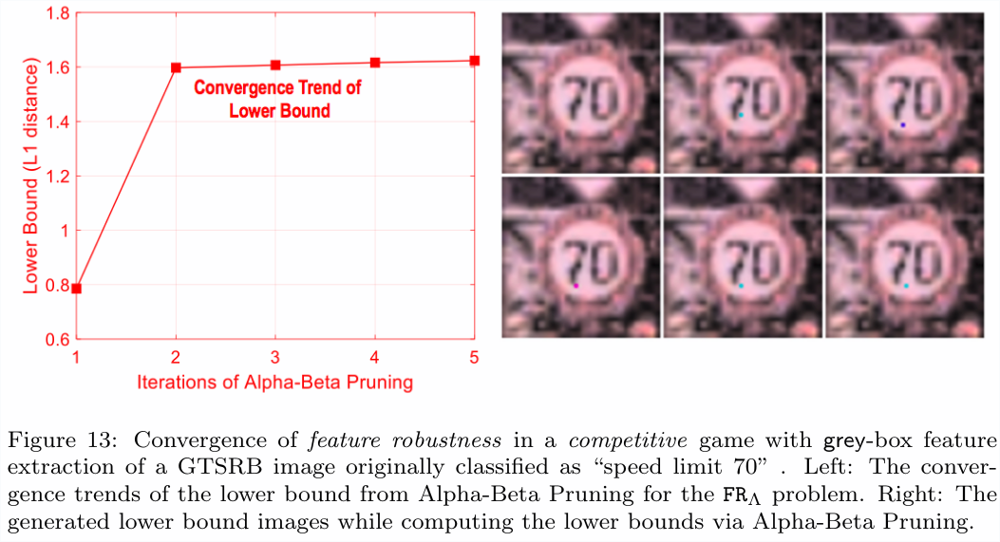

# Adversarial Examples
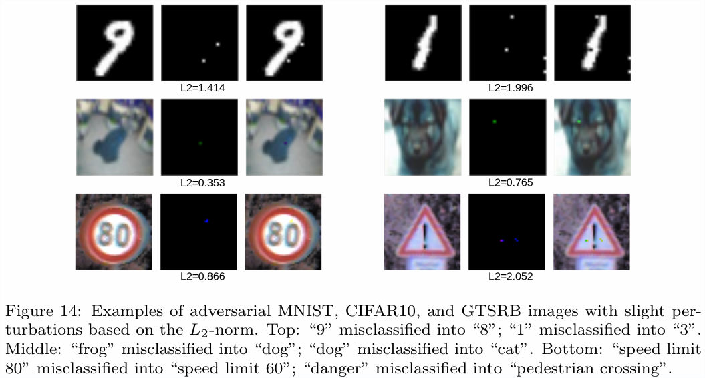
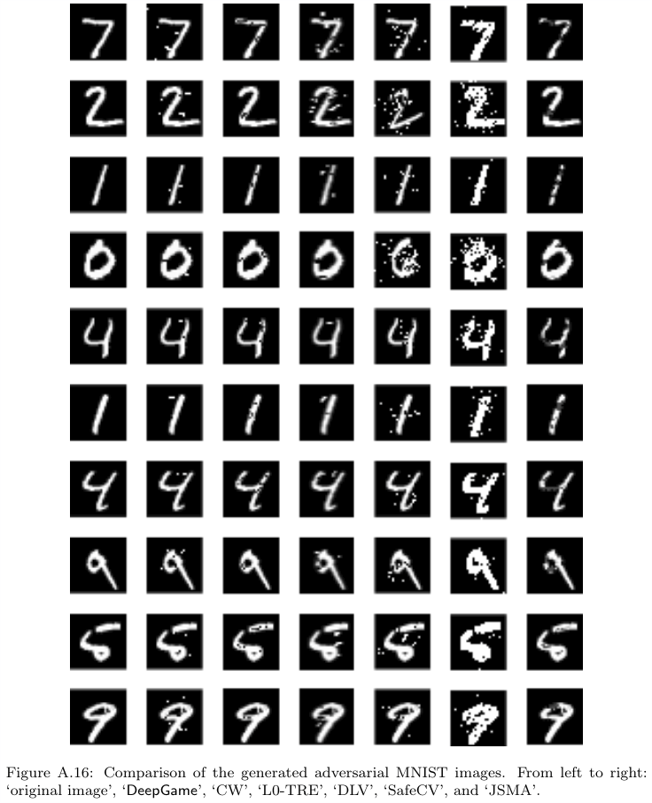
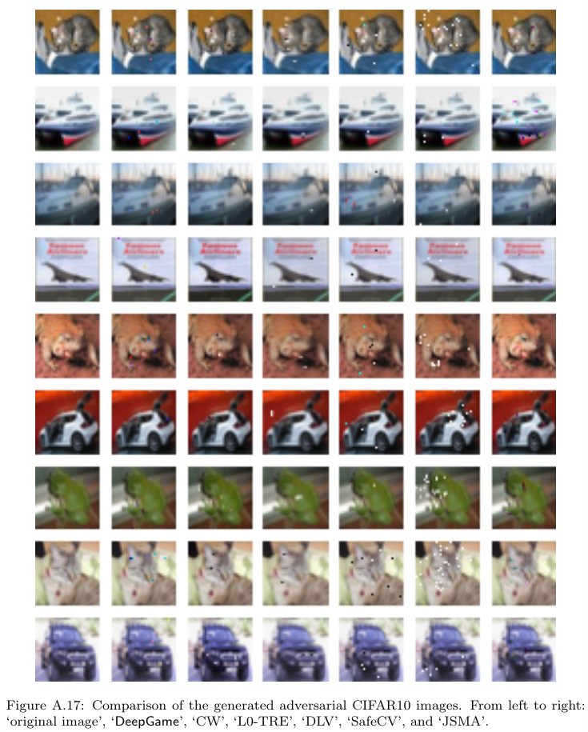
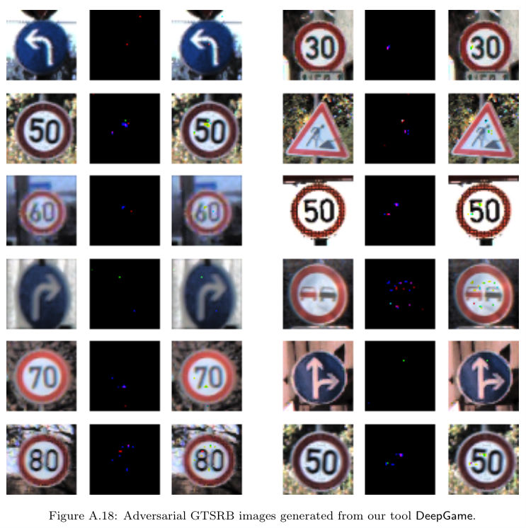

# Developer's Platform
```
python 3.5.5
keras 2.1.3
tensorflow-gpu 1.4.0
numpy 1.14.3
matplotlib 2.2.2
scipy 1.1.0
```

# Run
```
python main.py mnist ub cooperative 67 L2 10 1
```
or
```
./commands.sh
```

# Citation
```
@ARTICLE{2018arXiv180703571W,
   author = {{Wu}, Min and {Wicker}, Matthew and {Ruan}, Wenjie and {Huang}, Xiaowei and 
	{Kwiatkowska}, Marta},
    title = "{A Game-Based Approximate Verification of Deep Neural Networks with Provable Guarantees}",
  journal = {ArXiv e-prints},
archivePrefix = "arXiv",
   eprint = {1807.03571},
     year = 2018,
    month = jul,
      url = {https://arxiv.org/abs/1807.03571}
}

```

# Remark
This tool is under active development and maintenance, please feel free to contact us about any problem encountered.

Best wishes,

xiaowei.huang@cs.ox.ac.uk

min.wu@cs.ox.ac.uk
